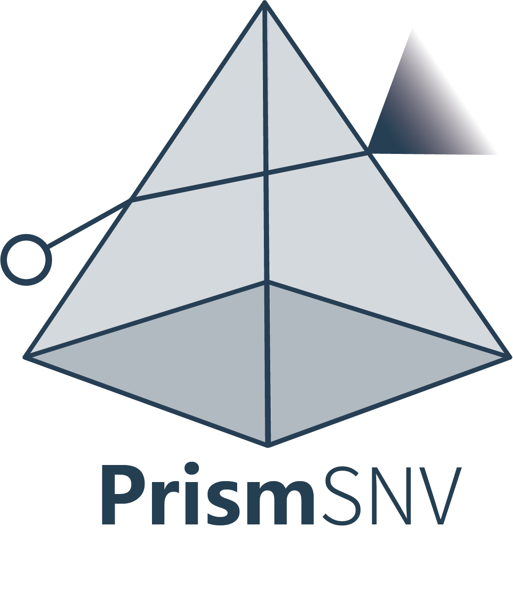

# PrismSNV
<div align=center></div>

<div align=center>
  


</div>


Single-nucleotide variants (SNVs) are central to tumor evolution, yet their functional consequences remain largely unresolved at single-cell resolution. Crucially, it remains unknown how the impact of specific SNVs varies across patients, cell types, or cellular states, hindering mechanistic understanding and therapeutic stratification. Current strategies operate predominantly at the bulk level and depend on population recurrence or evolutionary constraint, capturing signatures of long-term selection rather than direct, acute cellular effects.   
Here, we present PrismSNV, a single-cell modeling framework that redefines SNVs as endogenous perturbations of cellular state. By quantifying mutation-induced displacement in transcriptomic space, PrismSNV directly measures functional impact and uncovers the dynamic roles of individual SNVs throughout the spatiotemporal evolution of tumors.

<br>

<div align=center></div>
<br>


## Local Installation

This guide installs PrismSNV from a local checkout without publishing it to conda.

### 1. Create an environment

```bash
conda create -n prismsnv python=3.10 -y
conda activate prismsnv
```

### 2. Install external command-line dependencies


```bash
conda install -c conda-forge -c bioconda bash samtools bedtools openjdk -y
```

You also need a VarScan JAR file and should pass it with `--varscan-jar`.

### 3. Install PrismSNV locally

Run this from the repository root:

```bash
pip install -e .
```

Use `pip install .` instead if you want a non-editable install.

### 4. Verify the command

```bash
prismsnv --help
```

## Usage
Please see [PrismSNV Documents](https://muledoc.readthedocs.io/en/latest/index.html) for detail.

## ✉️ Contact

If you encounter any issues during use, please try updating STMiner to the latest version. If the issue persists, feel
free to submit your problem on the issue page or contact us through the following methods:

- Peisen Sun: 📧(sunpeisen@stu.xjtu.edu.cn) / 𝕏(https://x.com/Sun_python)
- Kai Ye: 📧(kaiye@xjtu.edu.cn)
