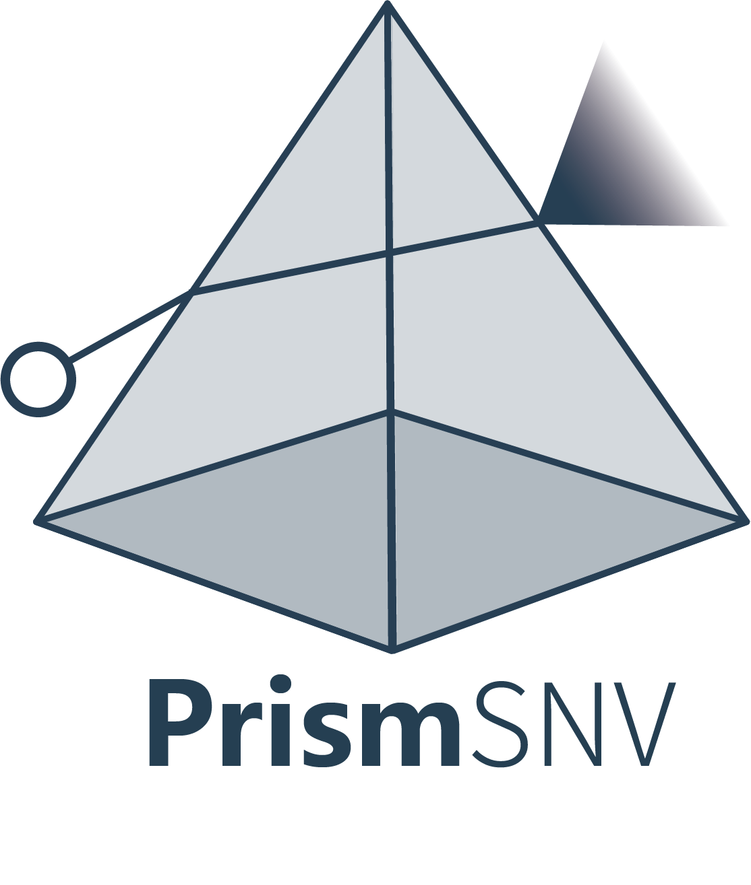

<div align="center">

# 🔬 PrismSNV

**A single-cell modeling framework that redefines SNVs as endogenous perturbations of cellular state.**



<br>


</div>

---

## 📚 Table of Contents

- [Overview](#-overview)
- [Architecture](#-architecture)
- [Local Installation](#️-local-installation)
- [Quick Start](#-quick-start)
- [Documentation](#-documentation)
- [Contact](#️-contact)
- [License](#-license)

---

## 🧬 Overview

Single-nucleotide variants (SNVs) are central to tumor evolution, yet their functional consequences remain largely unresolved at single-cell resolution. Crucially, it remains unknown how the impact of specific SNVs varies across patients, cell types, or cellular states — hindering mechanistic understanding and therapeutic stratification. Current strategies operate predominantly at the bulk level and depend on population recurrence or evolutionary constraint, capturing signatures of long-term selection rather than direct, acute cellular effects.

> **PrismSNV** redefines SNVs as endogenous perturbations of cellular state. By quantifying mutation-induced displacement in transcriptomic space, PrismSNV directly measures functional impact and uncovers the dynamic roles of individual SNVs throughout the spatiotemporal evolution of tumors.

### ✨ Key Features

| Feature | Description |
| --- | --- |
| 🎯 **Single-cell resolution** | Measures SNV functional impact directly at the single-cell level, rather than relying on bulk aggregates. |
| 🧪 **Endogenous perturbation modeling** | Treats each SNV as a natural perturbation of cellular state, capturing acute effects instead of long-term selection signals. |
| 📐 **Transcriptomic displacement** | Quantifies mutation-induced displacement in transcriptomic space as a direct readout of functional impact. |
| 🕰️ **Spatiotemporal dynamics** | Uncovers how individual SNVs change roles throughout tumor evolution. |

---

## 🏗️ Architecture

<div align="center">
  
</div>

---

## 🛠️ Local Installation

This guide installs PrismSNV from a local checkout without publishing it to conda.

### 1. 📥 Download PrismSNV

Clone the repository and enter the project directory:

```bash
git clone https://github.com/xjtu-omics/PrismSNV.git
cd PrismSNV
```

### 2. 🐍 Create an environment

```bash
conda create -n prismsnv python=3.10 -y
conda activate prismsnv
```

### 3. 📦 Install external command-line dependencies

```bash
conda install -c conda-forge -c bioconda bash samtools bedtools openjdk -y
```

> ⚠️ You also need a [VarScan](https://varscan.sourceforge.net/) JAR file and should pass it with `--varscan-jar`.

### 4. ⚙️ Install PrismSNV locally

Run this from the repository root:

```bash
pip install -e .
```

> 💡 Use `pip install .` instead if you want a non-editable install.

### 5. ✅ Verify the command

```bash
prismsnv --help
```

---

## 🚀 Quick Start

PrismSNV is driven by a single `prismsnv` command-line entry point that dispatches to five subcommands.

| Command | Description |
| --- | --- |
| `bam2vcf` | Runs the Bash SNV-calling pipeline for one or more BAM files, producing filtered VCF files after removing RNA-editing sites. |
| `snv2barcode` | Builds per-sample and merged barcode-by-SNV AnnData matrices from BAM, VCF, and barcode inputs defined in a YAML config. |
| `pre_train` | Aligns pretraining and finetuning RNA AnnData inputs, then trains the RNA-only backbone model. |
| `snv_effect` | Trains or evaluates the SNV perturbation model and exports functional-effect results. |
| `get_template` | Writes a `train_config.yaml` template into the current directory. |

### Typical workflow

```bash
# 0. Generate a configuration template
prismsnv get_template --output train_config.yaml

# 1. Call SNVs from BAM files
prismsnv bam2vcf --outer-jobs 6 --inner-threads 4 \
  --reference genome.fa --varscan-jar VarScan.jar \
  --rna-edit-bed RNA_edit.bed --out-dir ./snv_call_out \
  --bam-files sample1.bam sample2.bam

# 2. Build barcode-by-SNV matrices
prismsnv snv2barcode snv2barcode_config.yaml

# 3. Train the RNA backbone model
prismsnv pre_train -y train_config.yaml

# 4. Train/evaluate the SNV perturbation model
prismsnv snv_effect --n_gpu 3 -y train_config.yaml
```

Inspect any subcommand without processing data:

```bash
prismsnv <command> --help
```

---

## 📖 Documentation

Please see the [PrismSNV documentation](https://muledoc.readthedocs.io/en/latest/index.html) for detailed usage.

---

## ✉️ Contact

If you encounter any issues during use, please try updating PrismSNV to the latest version. If the issue persists, feel free to submit it on the [issue page](https://github.com/xjtu-omics/PrismSNV/issues) or contact us directly:

| Author | Email | X |
| --- | --- | --- |
| **Peisen Sun** | [sunpeisen@stu.xjtu.edu.cn](mailto:sunpeisen@stu.xjtu.edu.cn) | [@Sun_python](https://x.com/Sun_python) |
| **Kai Ye** | [kaiye@xjtu.edu.cn](mailto:kaiye@xjtu.edu.cn) | — |

---

## 📄 License

This project is licensed under the [GNU General Public License v3.0 (GPLv3)](./LICENSE).
